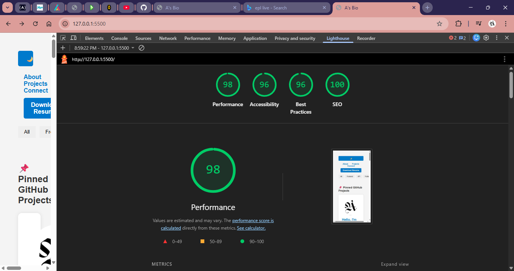

## 🚀 Live Demo

[🔗 View Portfolio Site](https://aswanjay07-source.github.io/portfolio-site/)
# 🌐 Personal Portfolio Website

Welcome to my personal portfolio! I'm Aswan Jay, an aspiring web developer from Kenya, passionate about building interactive and responsive websites.

## 🔍 Overview
This portfolio showcases my latest projects, skills, and design philosophy. It features dynamic GitHub repo cards, responsive layouts, and a clean UI with dark/light mode support.

## 🚀 Live Demo
[View on GitHub Pages](https://aswanjay07-source.github.io/portfolio-site/)

## 🔥 Features
- Responsive design for mobile, tablet, and desktop
- Dark/Light mode toggle
- GitHub API integration to auto-display my latest repositories
- Dynamic repo cards with tag-based filtering (coming soon)
- Clean layout and modern styling
- Contact form integration via Formspree (planned)

## 🛠️ Tech Stack
- HTML5 / CSS3
- JavaScript (Vanilla)
- GitHub REST API
- Formspree (for future contact form)
- Lighthouse (for performance audit)

## 📸 Screenshots

## 📈 Performance
Lighthouse score: 90+ on mobile and desktop  
Accessibility: WCAG AA compliant  
SEO: Semantic HTML and meta tags included

## 📂 Project Structure
- `/index.html` — Main landing page
- `/script.js` — Handles API calls and UI logic
- `/style.css` — Responsive styling and theme toggle
- `/screenshots/` — Preview images for documentation

## 📬 Connect with Me
- [GitHub](https://github.com/aswanjay07-source)
- [LinkedIn](https://www.linkedin.com/in/jay-aswan-937113395)

---

## 💡 Future Improvements
- Add contact form with email integration
- Include project filtering by tags
- Add animations and transitions
- Polish favicon and logo

## 🚀 Lighthouse Performance Report

**Performance:** 98  
**Accessibility:** 96  
**Best Practices:** 96  
**SEO:** 100  

## 🧩 Project Categories

### 🔹 Frontend Projects
- [Responsive Landing Page](https://github.com/aswanjay07-source/responsive-landing)

### 🔹 Fullstack Projects
- [Task Manager App](https://github.com/aswanjay07-source/task-manager)

### 🔹 API-Based Projects
- [Weather Dashboard](https://github.com/aswanjay07-source/weather-dashboard)

